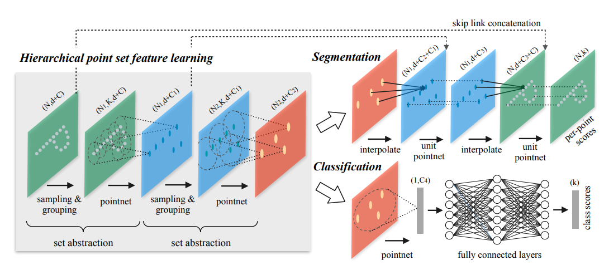

# PointNet++ Workshop: 3D Point Cloud Deep Learning

**An educational workshop teaching deep learning on 3D point cloud data—hands-on training for survey engineering students.**

This repository contains a complete 3-hour workshop (Jupyter notebook + web presentation) on **PointNet++**, a neural network architecture designed to process unordered 3D point clouds. Learn how to classify, analyze, and extract features from point cloud data using ModelNet10 dataset, with direct applications to LiDAR, BIM, and terrain analysis.

## 🎯 What You'll Learn

| Section | Topic | Time |
|---------|-------|------|
| 1-2 | Point cloud fundamentals & data exploration | 25 min |
| 3 | Data preprocessing pipeline | 15 min |
| 4 | PointNet++ architecture & hierarchy | 25 min |
| 5 | Training the model on ModelNet10 | 30 min |
| 6 | Feature visualization & interpretation | 25 min |
| 7 | Results analysis & confusion matrices | 20 min |
| 8 | Interactive prediction explorer | 15 min |
| 9 | Real-world survey engineering applications | 5 min |

**After this workshop, you will:**
- Understand unordered, sparse, hierarchical point cloud data structures
- Explain how PointNet++ learns features hierarchically with Set Abstraction modules
- Train a 3D object classifier from scratch (target: 70-80% accuracy)
- Visualize what neural networks learn from 3D geometry
- Apply point cloud deep learning to survey engineering (BIM classification, terrain analysis, quality control)

### 📋 Workshop Details
- **Duration:** 3 hours (lecture + hands-on coding)
- **Target Audience:** Survey engineering bachelor students (intermediate Python)
- **Prerequisites:** Basic Python, familiarity with 3D spatial data (LiDAR, photogrammetry)
- **Platform:** Google Colab (recommended—no GPU setup required) or local Jupyter

---

## 🚀 Quick Start (Google Colab) — 2 Minutes

**Easiest way to run the workshop (no local setup needed):**

1. Open [Google Colab](https://colab.research.google.com)
2. **Upload notebook:** `File → Upload notebook → pointnet2_workshop.ipynb`
3. **Enable GPU:** `Runtime → Change runtime type → Hardware accelerator → GPU`
4. **Run cells** in sequence (first cell installs dependencies automatically)

**Expected runtime:** ~30-40 minutes on GPU (training + analysis)

### Local Setup (Optional)

```bash
# Install dependencies (uv-managed)
pip install uv
uv sync

# Or with pip directly
pip install -e .

# Launch Jupyter
jupyter notebook pointnet2_workshop.ipynb
```

**Requirements:** Python 3.12+, PyTorch 2.0+, PyTorch Geometric

## 📚 Workshop Content

The notebook is structured in 9 progressive sections that build from fundamentals to applications:

**🔧 Sections 1-3: Foundation (40 min)**
- Understand why point clouds are special (unordered, sparse, hierarchical)
- Load ModelNet10 (1K shapes, 10 CAD categories)
- Preprocessing: normalize & sample to fixed 1024 points
- Interactive 3D visualization with Plotly

**🏗️ Section 4: PointNet++ Architecture (25 min)**



- **Set Abstraction (SA) layers** with Farthest Point Sampling (FPS)
- Hierarchical feature learning: 1024 → 512 → 128 → 1 points
- Local + global feature aggregation
- Why it works for unordered point clouds

**🔬 Sections 5-7: Training & Analysis (75 min)**
- Training loop: 30 epochs, ~15-20 min on GPU
- Feature visualization: PCA of local features, t-SNE of global features
- Confusion matrix analysis, per-class accuracy, confidence distributions
- Expected accuracy: **70-80% on ModelNet10**

**🎮 Section 8: Interactive Exploration (15 min)**
- Select test samples with an interactive widget
- Real-time predictions with confidence scores
- Understand model decisions

**🌍 Section 9: Real-World Applications (5 min)**
- Survey engineering use cases
- Extension ideas (segmentation, transfer learning, custom datasets)

## 📁 Files in This Repository

| File | Purpose |
|------|---------|
| **`pointnet2_workshop.ipynb`** | 9-section Jupyter notebook with complete code, visualizations, and explanations |
| **`index.html`** | Web-based presentation (retro 16-bit style) for instructors |
| **`pointnet2_modelnet10.pth`** | Pre-trained model checkpoint (~1.2M parameters) |
| **`assets/`** | Architecture diagrams, screenshots, and presentation images |
| **`data/`** | ModelNet10 dataset (auto-downloaded, ~300MB, cached) |
| **`pyproject.toml`** | Dependencies managed with `uv` |

## 🎓 Why PointNet++ for Survey Engineering?

| Why It Matters | Real-World Application |
|---|---|
| **Hierarchical feature learning** | Process LiDAR/BIM at multiple levels of detail (LoD) |
| **Permutation invariance** | Point order doesn't matter (like unordered survey data) |
| **Scalability** | Handle millions of points efficiently |
| **Direct point processing** | No voxelization or mesh conversion needed |

## 📊 Performance & Specs

| Metric | Value |
|--------|-------|
| **Training time** (30 epochs, Colab GPU) | ~15-20 minutes |
| **Expected accuracy** (ModelNet10) | 70-80% |
| **Model size** | 1.2M parameters |
| **Inference speed** | 50-100 samples/sec on GPU |
| **Input** | 1024 3D points (x, y, z) |
| **Output** | 10-class probabilities |

## 🔧 Tech Stack

- **PyTorch** — Deep learning framework
- **PyTorch Geometric** — Graph & point cloud operations
- **Plotly** — Interactive 3D visualization
- **scikit-learn** — PCA, t-SNE, metrics
- **Jupyter** — Interactive notebook environment

## ❓ Troubleshooting

| Problem | Solution |
|---------|----------|
| GPU not available in Colab | `Runtime → Change runtime type → GPU` or verify with `torch.cuda.is_available()` |
| Out of memory | Reduce batch size (32 → 16) in DataLoader |
| Slow data loading | First run downloads ModelNet10 (~300MB), subsequent runs use cache |
| Plotly visualization fails | Ensure JavaScript is enabled in browser; Matplotlib fallback available |
| Missing PyG dependencies | Install with: `pip install torch-geometric torch-scatter torch-sparse torch-cluster` |
| Miss match torch and torch-geometric versions | Check compatibility matrix: https://pytorch-geometric.readthedocs.io/en/latest/notes/installation.html |

## 📖 Resources & Next Steps

### Academic Papers
- **PointNet** (2017): https://arxiv.org/abs/1612.00593 — Foundation for direct point cloud processing
- **PointNet++** (2018): https://arxiv.org/abs/1706.02413 — Hierarchical feature learning
- **PointNeXt** (2022): https://arxiv.org/abs/2206.04670 — State-of-the-art point cloud architecture

### Recommended Datasets
- **ModelNet10/40** — CAD model classification (used in this workshop)
- **ShapeNet** — Large-scale 3D object dataset
- **ScanNet** — Indoor RGB-D sequences
- **S3DIS** — Semantic segmentation in indoor scenes

### Take This Further
1. **Semantic Segmentation** — Label each individual point
2. **Custom Data** — Apply to your own LiDAR or survey datasets
3. **Transfer Learning** — Fine-tune on construction/terrain data
4. **Larger Models** — Use PointNet++ with more SA blocks
5. **Multi-task Learning** — Joint classification + instance segmentation

## 🙏 Credits

- Based on [PyTorch Geometric PointNet++ example](https://github.com/pyg-team/pytorch_geometric)
- Educational design for survey engineering applications

## 📄 License

This project is licensed under the **MIT License** — see the [LICENSE](LICENSE) file for details. You're free to use, modify, and distribute this workshop for educational, commercial, or research purposes.

---

**Happy learning! 🚀**

Have questions? Check the notebook markdown explanations and [PyTorch Geometric docs](https://pytorch-geometric.readthedocs.io/). Ready to apply this to your own data? Go for it!
